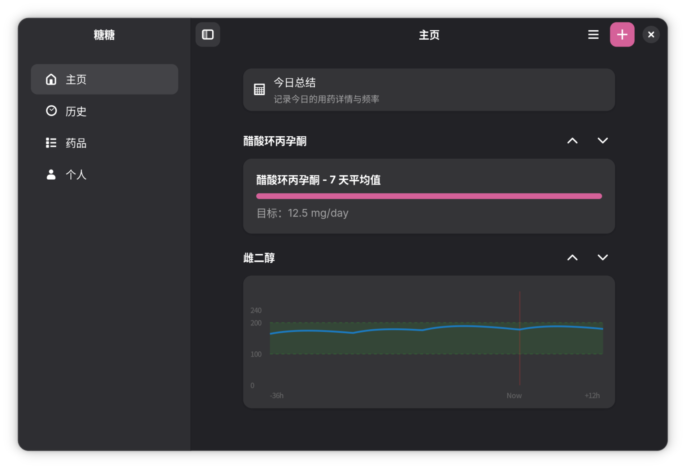
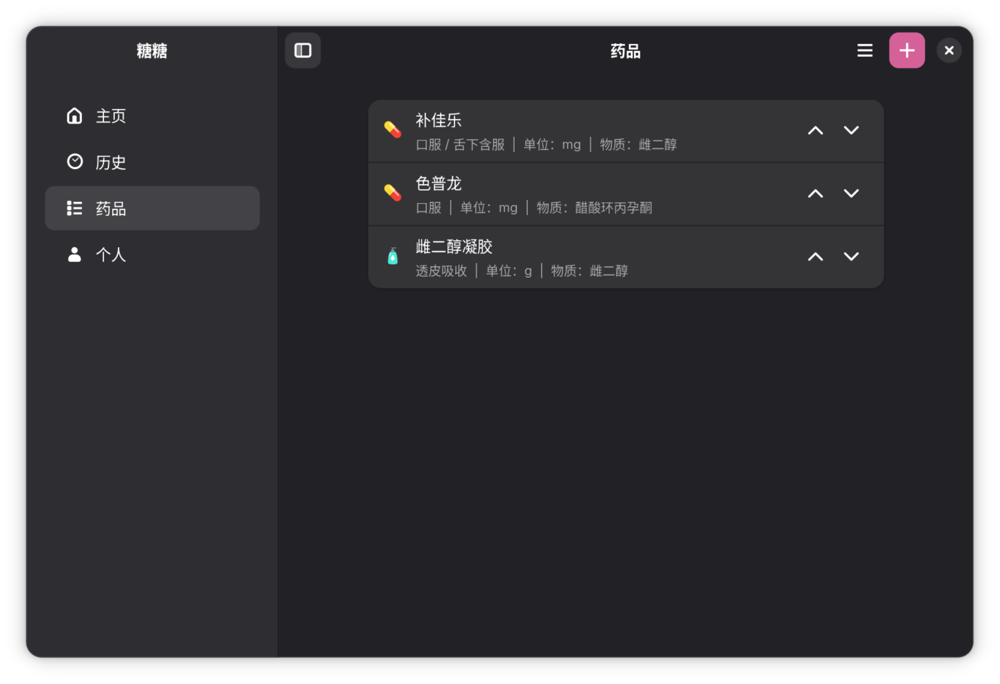
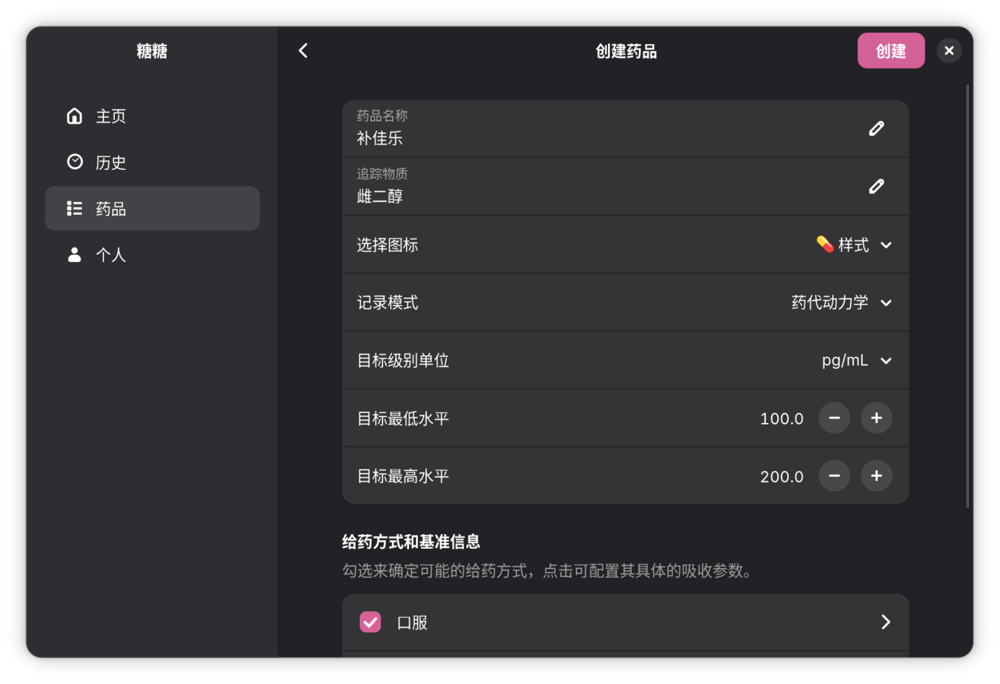

# 糖糖
README | [English](README.md) | 中文（简体）

**糖糖**是一个用来记录用药（例如跨性别 HRT 方案）的应用程序，基于 GTK4 开发。

## 功能特点
- 记录每日用药信息
- 图表展示用药历史及趋势
- 简洁的 GTK4 界面

## 截图

主页
 

药品页面

药品创建器

## 文档
请参阅 docs 文件夹

## 许可证
本项目使用 GPL-3.0-or-later 许可证。

详情请参阅 [COPYING](COPYING) 文件。
